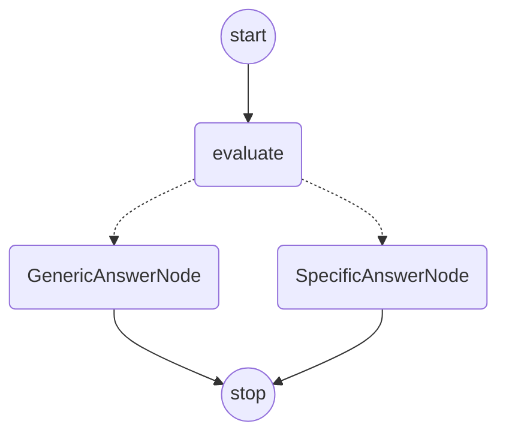

# AI Banking Agent - Spring Boot & MCP Ecosystem

A high-performance, production-ready AI agent built with **Spring Boot** and **LangChain4j**. This project demonstrates a multi-agent orchestration pattern using **LangGraph**, integrated with **Model Context Protocol (MCP)** for dynamic tool execution and **Langfuse** for advanced observability.

## 🚀 Core Capabilities

- **Stateful Multi-Agent Workflows**: Complex query routing and memory management powered by `langgraph4j`.
- **Dynamic Tool Integration**: Real-time connectivity to SQL databases and external services via the Model Context Protocol (MCP).
- **Cost-Optimized Observability**: Deep tracking of **Reasoning** and **Cached** tokens via Langfuse and OpenTelemetry.
- **Enterprise-Grade Infrastructure**: Containerized stack with automated PostgreSQL persistence and multi-stage builds.

---

## 🗺️ LangGraph Orchestration

The system uses a stateful directed graph to manage user interactions. This allows for intelligent routing between specialized nodes based on the intent of the query.

### Agent Routing Logic
The following diagram visualizes the internal logic of the agent, automatically generated by the `GraphExporter` during startup:



### Component Nodes
| Node | Service | Responsibility |
| :--- | :--- | :--- |
| **`evaluate`** | `ChatEvaluatorService` | Analyzes intent to route between Banking and General chat. |
| **`SpecificAnswerNode`** | `BankingAiService` | Handles core banking queries, SQL generation, and MCP tool execution. |
| **`GenericAnswerNode`** | `GenericAiService` | Provides high-quality responses for out-of-scope or general conversational queries. |

---

---

## 🛠️ MCP & SQL Connectivity

The system utilizes the **Model Context Protocol (MCP)** to securely expose data to the AI agent. Tools are served via an **HTTP SSE (Server-Sent Events) transport**.

### SQL Source: `fin-db`
The agent can query the `findb` PostgreSQL instance to retrieve user profiles, balances, and history using parameterized SQL.

### Core Tool Inventory
| Tool | Capability | Example Query |
| :--- | :--- | :--- |
| `getAccountCount` | Aggregate volume | "How many bank accounts does user ID 1 have?" |
| `getAccountBalances` | Full balance snapshot | "What is the balance of all accounts for user ID 1?" |
| `getRecentBankAccountTransactions` | Transaction history | "Show me the 5 most recent transactions for user ID 2." |
| `getCreditCardCount` | Card inventory | "How many credit cards are registered to user ID 4?" |
| `getCreditCardDetails` | Detailed card profiles | "List my credit cards and their details." |
| `getRecentCreditCardTransactions` | Credit monitoring | "What are the latest 5 transactions on my credit card?" |
| `getDepositSummary` | FD/Deposit analytics | "List all active deposits and their interest rates for user ID 3." |
| `getNextMaturityDate` | Precision planning | "When is the next FD maturing for user ID 1?" |

---

## 🚦 Usage

Once the services are running, you can interact with the agent using the provided `test-agent.http` file in your IDE or by running a `curl` command:

```bash
curl -X POST http://localhost:8080/agent/chat \
     -H "Content-Type: text/plain" \
     -d "What is the total combined balance across all bank accounts for Alice Smith?"
```

## 💬 Sample Interactions

### 🌍 General & Out-of-Scope Queries
Highlighting how the `GenericAnswerNode` handles general conversation and boundaries.

> **👤 User**
> > How are you today?
>
> **🤖 Assistant**
> > I’m sorry, but I’m only trained to handle banking and weather‑related queries. I can help you check account balances, recent transactions, or provide the current weather for any location. How may I assist you with those topics today?

> **👤 User**
> > Who won the cricket world cup?
>
> **🤖 Assistant**
> > I’m sorry, but I can only assist with banking‑related questions (such as account balances, transaction history, or deposit summaries) and current weather information. How may I help you with one of those topics today?

> **👤 User**
> > What is happening in US-Iran War?
>
> **🤖 Assistant**
> > I’m sorry, but I can only assist with banking‑related questions (such as account balances, transaction history, or deposit summaries) and current weather information. How may I help you with one of those topics today?

> **👤 User**
> > How is US economy doing now?
>
> **🤖 Assistant**
> > I’m sorry, but I can only assist with banking‑related questions (such as account balances, transaction history, or deposit summaries) and current weather information. How may I help you with one of those topics today?

### 🏦 Banking & Specialized Tasks
Demonstrating deep integration with `BankingDataTool` and SQL execution via MCP.

> **👤 User**
> > How many accounts does user with ID 1 have?
>
> **🤖 Assistant**
> > User ID 1 currently has 3 bank accounts registered in our system.

> **👤 User**
> > What is the total combined balance across all accounts for user ID 2?
>
> **🤖 Assistant**
> > "The total combined balance for user ID 2 across all of their bank accounts is $7,691.25."

> **👤 User**
> > How much has user ID 1 used this month on their credit card?
>
> **🤖 Assistant**
> > "User ID 1 has spent $0.00 on their credit‑card transactions so far this month."

> **👤 User**
> > Show me the last 5 transactions for user ID 3.
>
> **🤖 Assistant**
> > Here are the five most recent transactions for user ID 3, drawn from both the user’s bank‑account activity and credit‑card activity. They are ordered by the transaction date (most recent first) and include the source of each transaction.
> >
> > | # | Date (UTC) | Source | Account / Card | Amount | Type / Merchant | Description |
> > |---|------------|--------|----------------|--------|-----------------|-------------|
> > | 1 | 2025‑04‑13 09:34:53 UTC | Bank account | ACCT1003 | + 14.06 | DEPOSIT | “Bank transaction 49” |
> > | 2 | 2025‑04‑13 02:17:00 UTC | Bank account | ACCT1003 | + 257.39 | DEPOSIT | “Bank transaction 48” |
> > | 3 | 2025‑04‑10 14:58:25 UTC | Bank account | ACCT1003 | ‑ 37.19 | WITHDRAWAL | “Bank transaction 51” |
> > | 4 | 2025‑04‑01 07:42:48 UTC | Bank account | ACCT1003 | ‑ 220.06 | DEPOSIT* (negative amount) | “Bank transaction 36” |
> > | 5 | 2025‑03‑30 22:00:00 UTC | Credit card | 3782 8224 6310 005 | + 110.00 | Merchant: Electric Bill | — |
> >
> > *The “DEPOSIT” record shows a negative amount, which effectively represents a withdrawal/adjustment.
> >
> > What the data shows:
> > - The user’s most recent activity is a small deposit of $14.06 into bank account ACCT1003.
> > - The next two entries are also bank‑account transactions (a larger deposit and a withdrawal).
> > - The fourth most recent entry is a negative‑amount deposit on the same bank account, indicating a correction or withdrawal.
> > - The fifth most recent entry comes from the user’s credit‑card ending 3782 8224 6310 005, a payment of $110.00 to an electric‑bill merchant.

> **👤 User**
> > Show me the maturity amount for all deposits belonging to user ID 4.
>
> **🤖 Assistant**
> > Here are the maturity amounts for all deposits linked to user ID 4:
> >
> > | Deposit ID | Maturity Amount |
> > |------------|-----------------|
> > | 7          | $17,925.00 |
> > | 8          | $5,275.00 |
> >
> > If you need any additional details (e.g., principal amounts, interest rates, or upcoming maturity dates), just let me know!

## 🧪 Testing & Scenarios

The project includes a comprehensive `test-agent.http` file containing over 15+ test cases covering banking queries, weather, and out-of-scope interactions.

### 🧵 Multi-Turn Conversational Testing
To test the agent's memory and state persistence across multiple turns, use the **`X-Thread-Id`** header. This allows the `PostgresSaver` to retrieve previous interactions for that specific thread.

**Example Multi-Turn Flow:**
```bash
# First Turn: Query user balances
curl -X POST http://localhost:8080/agent/chat \
     -H "Content-Type: text/plain" \
     -H "X-Thread-Id: session-789" \
     -d "What are the account balances for user ID 1?"

# Second Turn: Follow up on the same user (Stateful)
curl -X POST http://localhost:8080/agent/chat \
     -H "Content-Type: text/plain" \
     -H "X-Thread-Id: session-789" \
     -d "Show me the last 5 transactions for these accounts."
```

## 🔍 Advanced Observability (Langfuse)

We leverage **Micrometer Tracing** and **OpenTelemetry** to export deep traces to **Langfuse**, providing comprehensive visibility into the agent's internal logic.

### 💰 Cost-Optimized Token Tracking
Our custom observability layer tracks specialized token metrics to help manage and reduce production costs:

- **Cached Tokens (Zero Cost)**: We explicitly highlight tokens served from the model's cache. **These tokens are generally free**, enabling complex agents to maintain large contexts at minimal cost.
- **Reasoning Tokens**: For models like GPT-4o, we track the internal reasoning tokens, giving you insight into the model's logic before it generates the final response.
- **Complete Token Mapping**: Monitor `prompt_tokens`, `completion_tokens`, and `total_tokens` for every execution.

![Token Attribution Detail]

*Detailed trace featuring reasoning and cached token attribution for cost-optimized operations.*

### 📊 Deep Trace Analysis
Traces exported to Langfuse allow for deep analysis of the multi-agent orchestration:

- **LLM-to-Tool Flow**: Visualize exactly how the agent reasons, calls a tool (e.g., `execute_sql` or `getAccountCount`), and then processes the result to formulate a final answer.
- **Input/Output Transparency**: See the full serialized message history (System, User, Assistant, Tool) for every turn.

![Langfuse Trace List]

*Cumulative trace dashboard showing model latency and overall token usage.*

![Langfuse Trace Workflow]

*A sample trace showing the internal transition from a user query to a tool call.*

![Banking Tool Call Trace]
*A specialized trace showing the agent's logic for a banking-specific tool call.*

---


## 🛠 Prerequisites

- **Java 17** or higher
- **Maven 3.6+**
- **Podman/Docker** with `podman-compose` support (Highly recommended for the full stack).
- **LLM API Key**: A valid key for Groq or OpenAI (configured via `application.yml` or environment variables).
- **MCP Server**: A running MCP server (default: `http://localhost:5000/mcp/sse`) for dynamic tool connectivity.
- **Langfuse Credentials**: Required for the advanced observability dashboard (optional but recommended).

## 🚀 Getting Started

The easiest way to run the entire stack (Agent, Databases, MCP Toolbox, and Langfuse) is using **Podman Compose**.

### 1. Clone & Configure
First, clone the repository and set your API key:

```bash
git clone <repository-url>
cd langchain-agent
```

Update `src/main/resources/application.yml` with your Groq (or OpenAI) API key:
```yaml
langchain4j:
  open-ai:
    chat-model:
      base-url: "https://api.groq.com/openai/v1"
      api-key: YOUR_API_KEY_HERE
      model-name: "openai/gpt-oss-120b"
```

### 2. Launch Services
Start all services (Databases, Langfuse, MCP Toolbox, and Agent) in detached mode. This command will also triggers the multi-stage build for the agent:
```bash
podman-compose up -d --build
```

### 3. Access Services
Once the containers are running, you can access the following:

| Service | URL | Description |
| :--- | :--- | :--- |
| **LangChain Agent** | [http://localhost:8080](http://localhost:8080) | The main AI agent API |
| **Langfuse** | [http://localhost:3000](http://localhost:3000) | Observability dashboard |
| **PostgreSQL** | `localhost:5432` | Database (User: `finuser`, Pass: `finpass`) |
| **MinIO Console** | [http://localhost:9001](http://localhost:9001) | Object storage UI |

### 🛠 Useful Commands
- **View Logs**: `podman-compose logs -f langchain-agent`

## 🗄 Database Setup (PostgreSQL)

The application relies on a PostgreSQL instance hosting three separate databases, all of which are automatically initialized when using `podman-compose`.

### 🗃 Databases
1.  **`findb`**: The primary database containing mock banking users, accounts, and transactions.
2.  **`langfuse`**: Dedicated storage for traces and observability metadata.
3.  **`langgraph_db`**: Used by the LangGraph agent for thread-safe state persistence and conversational memory.

---

## 📄 License

This project is licensed under the **MIT License** - see the [LICENSE](LICENSE) file for more details.
